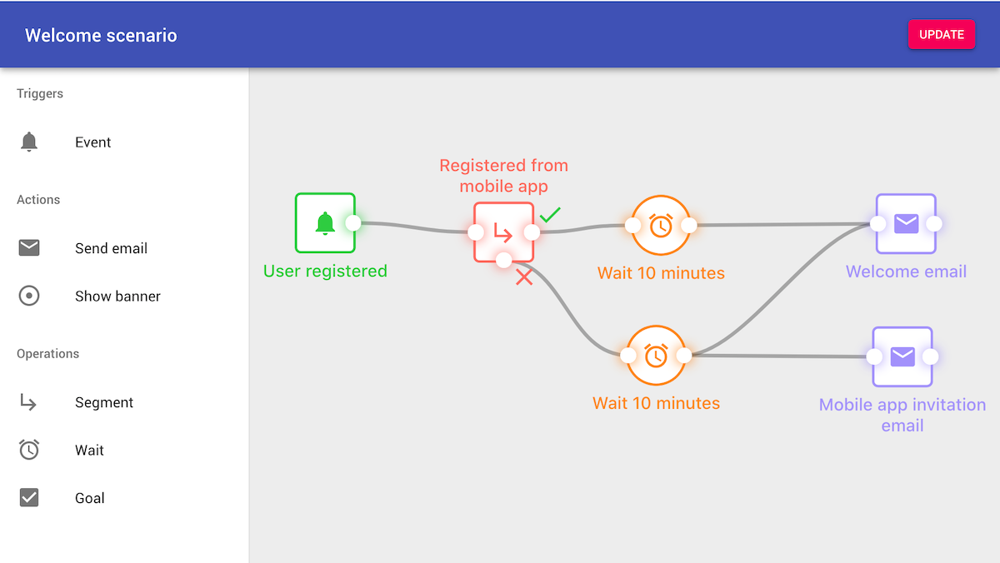

# CRM Scenarios Module


Scenarios module main feature is a scenario builder, a tool for modeling scenarios within CRM system using drag-and-drop UI toolkit. 
Each scenario is visually represented by a graph, connecting various events (e.g. user registration, subscription) 
with conditions (e.g. user segment check) and actions (e.g. send email, show banner).

<details>
<summary>Scenario example</summary>



</details>

## Scenario builder elements

Scenario builder provides several node types to build a graph with. 
User can link nodes in arbitrary ways, connecting output of one node into an input of another node. 
After saving (and enabling) the scenario, it will be executed every time the scenario trigger is hit.    

### Triggers

Each scenario has to start with a trigger node. Currently, there is only one trigger type - "Event" node.

#### Event

Event provides several hooks on changes related to user. Currently it supports event types:

- User created
- New subscription
- Subscription ends
- Recurrent payment renewal
- Test event (triggered by console command `scenarios:test_user`)

Every time user triggers specified event, all scenarios having this event will be executed, passing a user (triggering the scenario) down the graph.

### Actions

#### Send email

This node sends an email to an user who triggered the scenario and reached this node. Email list is loaded from CRM.  

#### Show banner 
<small><b>Warning:</b> enabled only when REMP-Campaign module is installed and integrated with Campaign tool.</small>

This node shows a one-time banner to user triggering the node. Available banners are loaded from Campaign tool.

### Operations

Typically, scenario actions should be reached only by a subset of users triggering the initial scenario trigger. 
Therefore, the builder provides several elements to filter users or delay execution of later actions in the graph.

#### Segment

Segment node checks whether user reaching the node is present in specified segment. Based on the result, the node redirects execution flow to either 
positive (user in segment) or negative (user not in segment) path. 

<details>
<summary>Segment node details</summary>


</details>


#### Wait 

This node simply delays execution of next element in a graph by specified time interval.

### Goal

Goal element checks if user triggering the node have completed selected onboarding goals. For more details, see "Onboarding module" documentation.

## Installing module

We recommend using Composer for installation and update management.

```shell
composer require remp/crm-scenarios-module
```

### Enabling module

Add installed extension to your `app/config/config.neon` file.

```neon
extensions:
    - Crm\ScenariosModule\DI\ScenariosModuleExtension
```

When it's added, generate ACL for newly created module.

```bash
php bin/command.php user:generate_access
php bin/command.php api:generate_access
php bin/command.php application:seed
```

#### Engine

Scenarios module requires Scenario engine worker to run separately in a background to process graph execution flows. 
In addition, it also requires Hermes worker to process asynchronous tasks.
Execute: 

```bash
php bin/command.php application:hermes_worker
php bin/command.php scenarios:worker
```

Make sure both workers are started again if killed, e.g. by running a service or a watchog.

