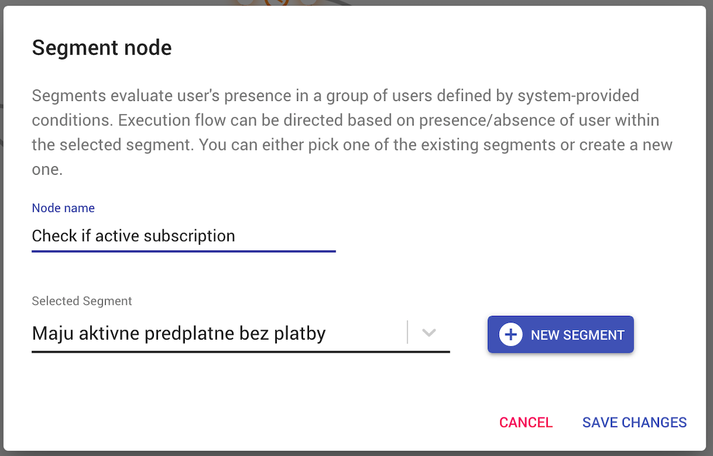

# CRM Scenarios Module


Scenarios module main feature is a scenario builder, a tool for modeling scenarios within CRM system using drag-and-drop UI toolkit. 
Each scenario is visually represented by a graph, connecting various events (e.g. user registration, subscription) 
with conditions (e.g. user segment check) and actions (e.g. send email, show banner).

<details>
<summary>Scenario example</summary>


</details>

## Scenario builder elements

Scenario builder provides several node types to build a graph with. 
User can link nodes in arbitrary ways, connecting output of one node into an input of another node. 
After saving (and enabling) the scenario, it will be executed every time the scenario trigger is hit.    

### Triggers

Each scenario has to start with a trigger node. Currently, there is two trigger types - "Event" node and "Before Event".

#### Event

Event provides several hooks on changes related to user. Currently it supports event types:

- User created
- New subscription
- Subscription ends
- Recurrent payment renewal
- Test event (triggered by console command `scenarios:test_user`)

Every time user triggers specified event, all scenarios having this event will be executed, passing a user (triggering the scenario) down the graph.

#### Before Event

Before Event requires two parameters - an event and a time interval. Time interval specifies how long before the actual event the trigger fires, starting the scenario.
Currently it supports event types:

- Subscription ends

### Conditions

The condition block allows to edit the flow of graph based on the result of specified criteria. One condition block is able to combine more criteria of a single type. All defined criteria are evaluated together and based on the result, graph flow follows either positive or negative direction. Currently supported criteria types:

- **User** - User criteria are evaluated based on parameters of a user who triggered the scenario. Criteria class has to implement `ScenariosCriteriaInterface`.
- **Payment** - Payments criteria are evaluated based on payment parameters of a scenario trigger. Such criteria can only be used in scenarios starting with triggers related to payments. Some triggers may or may not have payment parameters attached, e.g. 'New subscription' trigger. In such case, use 'Trigger' criteria (such as 'Has payment') check first to make sure payment parameters are present before using payments criteria. Criteria class has to implement `ScenariosCriteriaInterface`.
- **Subscription** - Subscription criteria are evaluated based on subscription parameters of a scenario trigger. Such criteria can only be used in scenarios starting with triggers related to subscriptions. Criteria class has to implement `ScenariosCriteriaInterface`.
- **Trigger** - Trigger criteria are evaluated based on parameters provided during the event triggering. Criteria class has to implement both interfaces `ScenariosTriggerCriteriaInterface` and `ScenariosCriteriaInterface`.

### Actions

#### Send email

This node sends an email to an user who triggered the scenario and reached this node. Email list is loaded from CRM.  

#### Show banner 
<small><b>Warning:</b> enabled only when REMP-Campaign module is installed and integrated with Campaign tool.</small>

This node shows a one-time banner to user triggering the node. Available banners are loaded from Campaign tool.

#### Run generic action

This node emits League event specified in `createEvent` method in generic action definition. You can specify custom params which will render in ui and will be passed as options to `createEvent` method.

You can try how this feature works by registering `TestGenericEvent` in your configuration:

```neon
services:
	scenariosGenericEventsManager:	
		setup:
			- register('test_gen_event', Crm\ScenariosModule\Scenarios\TestGenericEvent())
```

### Operations

Typically, scenario actions should be reached only by a subset of users triggering the initial scenario trigger. 
Therefore, the builder provides several elements to filter users or delay execution of later actions in the graph.

#### Segment

Segment node checks whether user reaching the node is present in specified segment. Based on the result, the node redirects execution flow to either 
positive (user in segment) or negative (user not in segment) path. 

<details>
<summary>Segment node details</summary>



</details>


#### Wait 

This node simply delays execution of next element in a graph by specified time interval.

### Goal

Goal element checks if user triggering the node have completed selected onboarding goals. For more details, see "Onboarding module" documentation.

### AB Test

AB Test element chooses one flow from two or more variants based on the percentual distribution.

## Installing module

We recommend using Composer for installation and update management.

```shell
composer require remp/crm-scenarios-module
```

### Enabling module

Add installed extension to your `app/config/config.neon` file.

```neon
extensions:
    - Crm\ScenariosModule\DI\ScenariosModuleExtension
```

When it's added, generate ACL for newly created module.

```bash
php bin/command.php user:generate_access
php bin/command.php api:generate_access
php bin/command.php application:seed
```

### Engine

Scenarios module requires Scenario engine worker to run separately in a background to process graph execution flows. 
In addition, it also requires Hermes worker to process asynchronous tasks.
Execute: 

```bash
php bin/command.php application:hermes_worker
php bin/command.php scenarios:worker
```

Make sure both workers are started again if killed, e.g. by running a service or a watchog.

Speed of engine processing is configurable. One can specify lower and upper limit on sleep delay between processing rounds (in each round, all jobs in queue are processed) in your configuration:

```neon
scenariosEngine:
    setup:
        # time in microseconds
        - setMinSleepTime(10000) #0.01s
        - setMaxSleepTime(10000000) # 10s 
```
The actual sleep time is computed using exponential backoff algorithm.
Default values are 0.05 and 1 second for min/max delay.

### Before events

For generating "Before Event" triggers, add the following command to your crontab. Optionally set it up to run every 10 minutes.

```bash
php bin/command.php scenarios:event_generator
```

### Graceful shutdown of workers

To gracefully shutdown both workers (`application:hermes_worker` and `scenarios:worker`) use command from [ApplicationModule](https://github.com/remp2020/crm-application-module):

```shell
php bin/command.php application:hermes_shutdown
```

Use this to in case CRM modules were updated and you need to reload workers. More details in README of [ApplicationModule](https://github.com/remp2020/crm-application-module).
